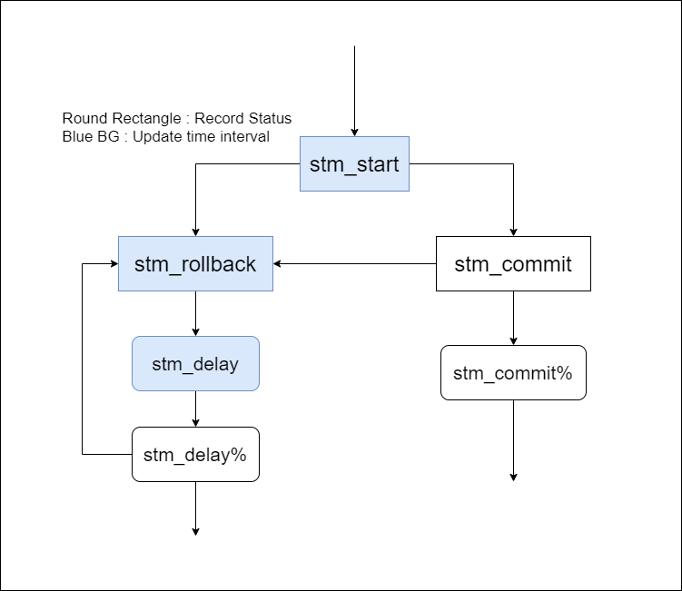

# Perf-On-STAMP

## Code Modified  
Replace or link `stm_internal.h` in `tinySTM/src` (stm_delay entry)  
Replace or link `thread.*` in `STAMP/lib/` (thread affinity)  

## Perf Probe and Run
### Usage  
Run Under STAMP directory. Make sure to specify file name in command argument.  
Modify argument `nthreads` to set thread number.  
ex. `$./perProbeRun.sh CTL_BACKOFF`  
The file name will be like `2021_06_17_CTL_BACKOFF`  
If not specified, the file name will only contain date, and older version will be replaced.  
You will be asked to select **Perf Status[0]** or **Perf Record[1]**  
Perf Status only shows Perf console, Perf Record generates `perftrace` in the `ptrace` directory.

## Convert perf data to Visualizer data
Run `convert.py` to convert perf data to visualizer data.  
The scrip implements state transition as follow:  

### Usage
Provide your perf data path as sysarg.  
ex. `$ python Convert.py ptrace/2050_12_25_ETL_DELAY`  
Visualizer data with sufix `.log` file will be generated. 
* Tag 0 indicate **start to delay**
* Tag 1 indicate **delay entry to delay return**
* Tag 2 indicate **commit return**

## STAMP 
Written by Tonie Lai with a few modified.   
Modify argument `THREAD_NUM` to set thread number.  
To avoid cache locality, which could greatly affect execution time, each stamp application is take turns to execute.    
Run Under STAMP directory and make sure to specify file name in command argument.  
ex. `$./stamp.sh ETL_BACKOFF`  
Log file will be generate under `$STAMMP_BASE/recore/run_log` directory

## Rec.py
Calculate the average execution time and plot the result.  
You can refer to [matplotlib](https://matplotlib.org/stable/gallery/color/named_colors.html) to change color of the cylinder.  

### Usage
Provide your log file path as sysarg.  
ex: `$  python Rec.py record/run_log/2050_12_25_ETL_SUICIDE`  
You'll see `summary.txt` under the log file and a pop out plot window.  
